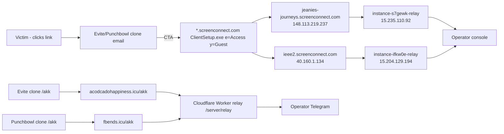

# Infrastructure Evidence (validated)

## ScreenConnect RAT tenants (ConnectWise SaaS, OVH hosting)

| Tenant (web/installer) | CNAME target | IP | Relay host (embedded in installer) | Relay IP | Region |
|---|---|---|---|---|---|
| `jeanies-journeys.screenconnect.com` | `server-ovh60020004-web.screenconnect.com` | `148.113.219.237` | `instance-s7gewk-relay.screenconnect.com` | `15.235.110.92` | OVH CA |
| `ieee2.screenconnect.com` | `server-ovh30010021-web.screenconnect.com` | `40.160.1.134` | `instance-ifkw0e-relay.screenconnect.com` | `15.204.129.194` | OVH US |

- **TLS:** wildcard `*.screenconnect.com`, `CN=ConnectWise, LLC`, DigiCert Global G2 — both tenants share it (vendor CDN).
- **ScreenConnect build:** `26.5.3.9691` (PE File/ProductVersion; portal `Script.ashx` reports same).
- **Installer:** `ScreenConnect.ClientSetup.exe`, 12,809,272 bytes, downloaded from `/Bin/ScreenConnect.ClientSetup.exe?e=Access&y=Guest`.
  - Tenant A SHA-256: `c68c432515df92ebe29b9eb3dab6a2d2cf1dea292eae3d5f5e081b05ae86f422`
  - Tenant B SHA-256: `5d7a14e9719d05b1bd20099923b12e80911f03f989fe18199aa983054cc4605e`
- **Access-mode semantics:** `e=Access` → unattended persistent agent (Windows service, survives reboot); `y=Guest` → enrolls into the operator's tenant with **no victim-side authentication**. RSA tenant key (`k=...`) embedded per installer.

### Why per-tenant hashes differ
Both installers are the same stock ScreenConnect Access client build but each embeds its tenant's relay hostname + RSA public key. Hash-per-tenant blocking therefore works; blocking the vendor hash does not.

## Credential-phish domains (Cloudflare-proxied, Cloudflare managed challenge)

| Domain | Registrar | Created | NS | Path | Status 2026-09-04 |
|---|---|---|---|---|---|
| `acodcadohappiness.icu` | PDR Ltd (PublicDomainRegistry) | 2026-07-30 | `sevki/elly.ns.cloudflare.com` | `/akk/` | live (403 managed challenge to bots) |
| `fbends.icu` | PDR Ltd | 2026-08-25 | `pola/tate.ns.cloudflare.com` | `/akk` | live (403 managed challenge to bots) |

- Both resolve to Cloudflare anycast (e.g., `104.21.x`, `172.67.x`); origin hidden.
- Lure artwork for the 08-27 wave hosted on Cloudflare R2: `pub-58388a1519064228b441a5517c701114.r2.dev/pb.png`.
- Tracking pixel: `nav-adv0cati0n.im/invitesz/` (.im registry; no NS at last check).

## Prior campaign infra (linked, not part of RAT delivery)

- Origin/C2 host: `66.163.122.218` (GTHost) — Overlord 2.5.9 panel at `burt-drop.mom`, ports 443/4443/5174/8443.
- Kit backend: Cloudflare Worker relay `/server/relay` (operator-in-the-loop, Telegram).

## Network map (Mermaid)

*Validation notes: DNS A/CNAME + WHOIS + TLS Subject/Issuer + HTTP behavior collected 2026-08-24 and 2026-09-04. Both tenants and both /akk domains remained live at last check.*
